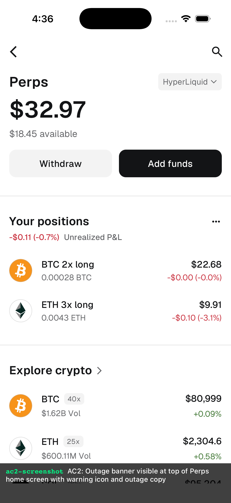
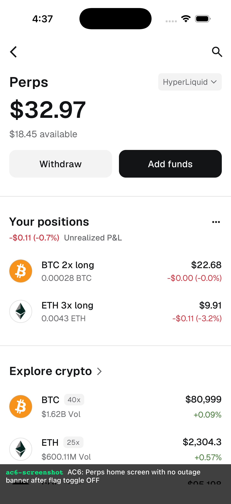

## **Description**

Adds an in-app outage banner to the Perps home screen and market details screen, displayed when the `perpsPerpTradingServiceInterruptionBannerEnabled` remote feature flag is toggled ON by CS/support.

**What it does:**
- New `PerpsServiceInterruptionBanner` component showing outage messaging with links to customer support and Hyperliquid for direct position management
- Banner renders at the top of both Perps Home and Market Details screens
- Controlled entirely by an existing remote feature flag — no code deploy required to activate
- Adds `outage_banner_shown` (boolean) property to `PERPS_SCREEN_VIEWED` Mixpanel events on both screens

**Why:**
During Hyperliquid outages, users with open positions have no in-app signal. This banner reduces support ticket volume and preserves trust by clearly communicating the incident state.

## **Changelog**

CHANGELOG entry: Added in-app outage banner for Perps, controlled by remote feature flag

## **Related issues**

Fixes: https://consensyssoftware.atlassian.net/browse/TAT-2280

## **Manual testing steps**

```gherkin
Feature: Perps service interruption banner

  Scenario: Banner hidden when flag is OFF
    Given the service interruption flag is OFF (default)
    When user opens the Perps home screen
    Then no outage banner is displayed

  Scenario: Banner shown when flag is ON
    Given the service interruption flag is ON
    When user opens the Perps home screen
    Then an outage banner is displayed at the top with warning icon
    And the banner contains links to customer support and Hyperliquid

  Scenario: Banner disappears after flag toggled OFF
    Given the service interruption flag was ON and banner was visible
    When the flag is toggled OFF
    And user navigates to Perps home
    Then the banner is no longer displayed
```

## **Screenshots/Recordings**

### **Before**

N/A — purely additive feature. No existing behavior changed.

### **After**

| Banner ON | Banner OFF |
|-----------|------------|
|  |  |

## **Validation Recipe**
<details><summary>recipe.json (14 steps — flag toggle, banner visibility, teardown)</summary>

```json
{
  "title": "Verify perps service interruption banner shows when flag is enabled",
  "initial_conditions": { "testnet": false },
  "validate": {
    "workflow": {
      "pre_conditions": ["wallet.unlocked", "perps.feature_enabled"],
      "entry": "ac1-navigate-home",
      "nodes": {
        "ac1-navigate-home": {
          "action": "navigate",
          "target": "PerpsHomeView",
          "next": "ac1-wait-home"
        },
        "ac1-wait-home": {
          "action": "wait_for",
          "test_id": "perps-home-heading",
          "timeout_ms": 10000,
          "next": "ac1-check-no-banner"
        },
        "ac1-check-no-banner": {
          "action": "eval_sync",
          "expression": "JSON.stringify({ flagValue: String(process.env.MM_PERPS_SERVICE_INTERRUPTION_BANNER_ENABLED || 'undefined') })",
          "assert": { "operator": "neq", "field": "flagValue", "value": "true" },
          "note": "AC1: Flag OFF — env var is not 'true', so banner component returns null",
          "next": "ac2-enable-flag"
        },
        "ac2-enable-flag": {
          "action": "eval_sync",
          "expression": "JSON.stringify({ set: (function() { process.env.MM_PERPS_SERVICE_INTERRUPTION_BANNER_ENABLED = 'true'; return true; })() })",
          "assert": { "operator": "eq", "field": "set", "value": true },
          "note": "Enable service interruption banner via local env override",
          "next": "ac2-reload"
        },
        "ac2-reload": {
          "action": "navigate",
          "target": "PerpsHomeView",
          "next": "ac2-wait-banner"
        },
        "ac2-wait-banner": {
          "action": "wait_for",
          "test_id": "perps-service-interruption-banner",
          "timeout_ms": 10000,
          "next": "ac2-screenshot"
        },
        "ac2-screenshot": {
          "action": "screenshot",
          "filename": "evidence-ac2-banner-visible.png",
          "note": "AC2: Outage banner visible at top of Perps home screen with warning icon and outage copy",
          "next": "ac6-disable-flag"
        },
        "ac6-disable-flag": {
          "action": "eval_sync",
          "expression": "JSON.stringify({ set: (function() { process.env.MM_PERPS_SERVICE_INTERRUPTION_BANNER_ENABLED = 'false'; return true; })() })",
          "assert": { "operator": "eq", "field": "set", "value": true },
          "note": "AC6: Toggle flag OFF",
          "next": "ac6-reload"
        },
        "ac6-reload": {
          "action": "navigate",
          "target": "PerpsHomeView",
          "next": "ac6-wait-home"
        },
        "ac6-wait-home": {
          "action": "wait_for",
          "test_id": "perps-home-heading",
          "timeout_ms": 10000,
          "next": "ac6-wait-banner-gone"
        },
        "ac6-wait-banner-gone": {
          "action": "wait",
          "ms": 500,
          "next": "ac6-verify-flag-off"
        },
        "ac6-verify-flag-off": {
          "action": "eval_sync",
          "expression": "JSON.stringify({ flagValue: String(process.env.MM_PERPS_SERVICE_INTERRUPTION_BANNER_ENABLED || 'undefined') })",
          "assert": { "operator": "eq", "field": "flagValue", "value": "false" },
          "note": "AC6: Flag is OFF — banner component returns null",
          "next": "ac6-screenshot"
        },
        "ac6-screenshot": {
          "action": "screenshot",
          "filename": "evidence-ac6-banner-gone.png",
          "note": "AC6: Perps home screen with no outage banner after flag toggle OFF",
          "next": "teardown-reset-flag"
        },
        "teardown-reset-flag": {
          "action": "eval_sync",
          "expression": "JSON.stringify({ reset: (function() { delete process.env.MM_PERPS_SERVICE_INTERRUPTION_BANNER_ENABLED; return true; })() })",
          "assert": { "operator": "eq", "field": "reset", "value": true },
          "next": "done"
        },
        "done": {
          "action": "end",
          "status": "pass"
        }
      }
    }
  }
}
```
</details>

## **Validation Logs**
Command:
```bash
bash scripts/perps/agentic/validate-recipe.sh .task/feat/tat-2280-0513-153404/artifacts/ --skip-manual
```

<details><summary>Full output (14/14 passed)</summary>

```
Running recipe: Verify perps service interruption banner shows when flag is enabled
Pre-conditions: wallet.unlocked, perps.feature_enabled
Workflow nodes: 15

Pre-conditions: PASS

[ac1-navigate-home] navigate to PerpsHomeView — PASS
[ac1-wait-home] wait for perps-home-heading — PASS
[ac1-check-no-banner] eval_sync result: {"flagValue":"undefined"} — PASS
[ac2-enable-flag] eval_sync result: {"set":true} — PASS
[ac2-reload] navigate to PerpsHomeView — PASS
[ac2-wait-banner] wait for perps-service-interruption-banner — PASS
[ac2-screenshot] evidence-ac2-banner-visible.png — PASS
[ac6-disable-flag] eval_sync result: {"set":true} — PASS
[ac6-reload] navigate to PerpsHomeView — PASS
[ac6-wait-home] wait for perps-home-heading — PASS
[ac6-wait-banner-gone] wait 500ms — PASS
[ac6-verify-flag-off] eval_sync result: {"flagValue":"false"} — PASS
[ac6-screenshot] evidence-ac6-banner-gone.png — PASS
[teardown-reset-flag] eval_sync result: {"reset":true} — PASS

Results: 14/14 passed
Recipe: PASS
```
</details>

## **Pre-merge author checklist**

- [x] I've followed [MetaMask Contributor Docs](https://github.com/MetaMask/contributor-docs) and [MetaMask Mobile Coding Standards](https://github.com/MetaMask/metamask-mobile/blob/main/.github/guidelines/CODING_GUIDELINES.md).
- [x] I've completed the PR template to the best of my ability
- [x] I've included tests if applicable
- [x] I've documented my code using [JSDoc](https://jsdoc.app/) format if applicable
- [x] I've applied the right labels on the PR (see [labeling guidelines](https://github.com/MetaMask/metamask-mobile/blob/main/.github/guidelines/LABELING_GUIDELINES.md)). Not required for external contributors.

#### Performance checks (if applicable)

- [ ] I've tested on Android
- [ ] I've tested with a power user scenario
- [ ] I've instrumented key operations with Sentry traces for production performance metrics

## **Pre-merge reviewer checklist**

- [ ] I've manually tested the PR (e.g. pull and build branch, run the app, test code being changed).
- [ ] I confirm that this PR addresses all acceptance criteria described in the ticket it closes and includes the necessary testing evidence such as recordings and or screenshots.
