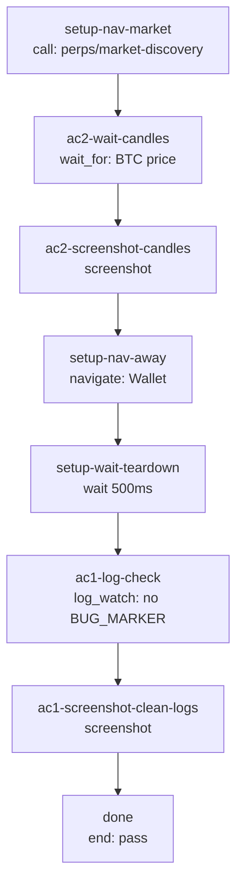

## **Description**

AbortErrors from candle fetch cancellations during normal navigation/view teardown were treated as real errors and logged to Sentry at 3 service layers. Added `isAbortError()` utility and abort guards at all 3 catch blocks (`HyperLiquidClientService`, `MarketDataService`, `CandleStreamChannel`) to suppress expected cancellation noise while preserving real error reporting.

## **Changelog**

CHANGELOG entry: Fixed noisy Sentry error reports from expected candle fetch cancellations during navigation

## **Related issues**

Fixes: [TAT-2971](https://consensyssoftware.atlassian.net/browse/TAT-2971)

## **Manual testing steps**

```gherkin
Feature: Candle fetch cancellation handling

  Scenario: user navigates away from market detail during candle load
    Given the user is on the Perps BTC market detail screen
    And candle data is loading via WebSocket

    When user navigates away from the market detail screen
    Then no AbortError is logged to Sentry
    And candle data loaded successfully before navigation

  Scenario: real candle fetch failure still reports
    Given the user is on the Perps BTC market detail screen
    When a real network error occurs during candle fetch
    Then the error is logged to Sentry normally
```

## **Screenshots/Recordings**

### **Before**

<!-- Evidence will be inserted by gateway -->

### **After**

<!-- Evidence will be inserted by gateway -->

## **Pre-merge author checklist**

- [x] I've followed [MetaMask Contributor Docs](https://github.com/MetaMask/contributor-docs) and [MetaMask Mobile Coding Standards](https://github.com/MetaMask/metamask-mobile/blob/main/.github/guidelines/CODING_GUIDELINES.md).
- [x] I've completed the PR template to the best of my ability
- [x] I've included tests if applicable
- [x] I've documented my code using [JSDoc](https://jsdoc.app/) format if applicable
- [x] I've applied the right labels on the PR (see [labeling guidelines](https://github.com/MetaMask/metamask-mobile/blob/main/.github/guidelines/LABELING_GUIDELINES.md)). Not required for external contributors.

## **Pre-merge reviewer checklist**

- [ ] I've manually tested the PR (e.g. pull and build branch, run the app, test code being changed).
- [ ] I confirm that this PR addresses all acceptance criteria described in the ticket it closes and includes the necessary testing evidence such as recordings and or screenshots.

## **Validation Recipe**

<details>
<summary>recipe.json</summary>

```json
{
  "pr": "28953",
  "title": "Verify candle abort errors are not logged to Sentry",
  "jira": "TAT-2971",
  "acceptance_criteria": [
    "Expected candle-request cancellations (AbortError) are not reported as errors to Sentry/Logger",
    "Real candle fetch failures still log/report normally to Sentry/Logger",
    "No new TypeScript errors introduced"
  ],
  "validate": {
    "static": ["yarn lint:tsc"],
    "workflow": {
      "pre_conditions": ["wallet.unlocked", "perps.feature_enabled"],
      "entry": "setup-nav-market",
      "nodes": {
        "setup-nav-market": {
          "action": "call",
          "ref": "perps/market-discovery",
          "params": { "symbol": "BTC" },
          "next": "ac2-wait-candles"
        },
        "ac2-wait-candles": {
          "action": "wait_for",
          "expression": "Engine.context.PerpsController.getMarketDataWithPrices().then(function(ms){var m=ms.find(function(x){return x.symbol==='BTC'});return JSON.stringify({found:!!m,price:m?m.price:'0'})})",
          "assert": {
            "operator": "not_null",
            "field": "price"
          },
          "timeout_ms": 15000,
          "next": "ac2-screenshot-candles"
        },
        "ac2-screenshot-candles": {
          "action": "screenshot",
          "filename": "evidence-ac2-candles-loaded.png",
          "next": "setup-nav-away"
        },
        "setup-nav-away": {
          "action": "navigate",
          "target": "Wallet",
          "next": "setup-wait-teardown"
        },
        "setup-wait-teardown": {
          "action": "wait",
          "ms": 500,
          "next": "ac1-log-check"
        },
        "ac1-log-check": {
          "action": "log_watch",
          "window_seconds": 10,
          "must_not_appear": ["BUG_MARKER: abort error logged to Sentry"],
          "watch_for": ["CandleStreamChannel"],
          "next": "ac1-screenshot-clean-logs"
        },
        "ac1-screenshot-clean-logs": {
          "action": "screenshot",
          "filename": "evidence-ac1-no-abort-noise.png",
          "next": "done"
        },
        "done": {
          "action": "end",
          "status": "pass"
        }
      }
    }
  }
}
```

</details>

## **Recipe Workflow**

<details>
<summary>workflow graph</summary>



</details>
