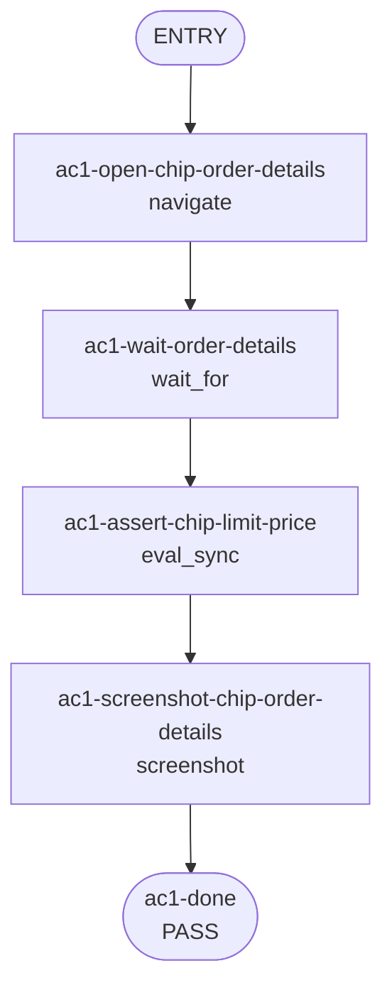

## **Description**

Open-order trigger and limit prices now use the same market-price precision rules as Perps market prices. This fixes low-priced markets such as CHIP showing rounded two-decimal prices in compact open-order rows and order details, while leaving USD notional values and fees on fiat formatting.

Self-review follow-up added explicit trigger-condition interpolation coverage for the `$0.001234` formatting path and clarified the executable recipe scope.

## **Changelog**

CHANGELOG entry: Fixed open order trigger and limit prices to display the correct market decimal precision.

## **Related issues**

Fixes: [TAT-3094](https://consensyssoftware.atlassian.net/browse/TAT-3094)

## **Manual testing steps**

```gherkin
Feature: Open order price precision

  Scenario: Low-priced market limit order details use market precision
    Given the wallet is unlocked and Perps are available
    When a CHIP limit order with price "0.001234" is opened in order details
    Then the Price row displays "$0.001234"
    And the Order value row may still display fiat notional precision such as "$0.12"

  Scenario: Compact open order rows use market precision
    Given the wallet has an open limit, take-profit, or stop-loss order
    When the order is shown in a compact order row
    Then the trigger or limit price uses the same decimal precision as the market price
```

Additional automated coverage:

- `PerpsOrderDetailsView.test.tsx` asserts the trigger-condition translation receives `price: '$0.001234'`.
- `PerpsCompactOrderRow.test.tsx` asserts compact order rows pass universal price ranges to the formatter.

## **Screenshots/Recordings**

Artifact upload will attach the before/after recording and the CHIP order details screenshot.

### **Before**

Pending artifact upload.

### **After**

Pending artifact upload.

## **Pre-merge author checklist**

- [x] I've followed [MetaMask Contributor Docs](https://github.com/MetaMask/contributor-docs) and [MetaMask Mobile Coding Standards](https://github.com/MetaMask/metamask-mobile/blob/main/.github/guidelines/CODING_GUIDELINES.md).
- [x] I've completed the PR template to the best of my ability
- [x] I've included tests if applicable
- [x] I've documented my code using [JSDoc](https://jsdoc.app/) format if applicable
- [x] I've applied the right labels on the PR (see [labeling guidelines](https://github.com/MetaMask/metamask-mobile/blob/main/.github/guidelines/LABELING_GUIDELINES.md)). Not required for external contributors.

#### Performance checks (if applicable)

- [x] I've tested on Android
  - Ideally on a mid-range device; emulator is acceptable
- [x] I've tested with a power user scenario
  - Use these [power-user SRPs](https://consensyssoftware.atlassian.net/wiki/spaces/TL1/pages/edit-v2/401401446401?draftShareId=9d77e1e1-4bdc-4be1-9ebb-ccd916988d93) to import wallets with many accounts and tokens
- [x] I've instrumented key operations with Sentry traces for production performance metrics
  - See [`trace()`](/app/util/trace.ts) for usage and [`addToken`](/app/components/Views/AddAsset/components/AddCustomToken/AddCustomToken.tsx#L274) for an example

For performance guidelines and tooling, see the [Performance Guide](https://consensyssoftware.atlassian.net/wiki/spaces/TL1/pages/400085549067/Performance+Guide+for+Engineers).

## **Pre-merge reviewer checklist**

- [ ] I've manually tested the PR (e.g. pull and build branch, run the app, test code being changed).
- [ ] I confirm that this PR addresses all acceptance criteria described in the ticket it closes and includes the necessary testing evidence such as recordings and or screenshots.

## **Validation Recipe**

<details>
<summary>recipe.json</summary>

```json
{
  "pr": "29770",
  "title": "Mobile decimals on open orders",
  "jira": "TAT-3094",
  "acceptance_criteria": [
    "Open orders (limit, TP, SL) on wallet home, perps home and perp market detail screens display the same number of decimals for trigger/limit price as the displayed market price (examples: 0 for BTC, 2 for CL, 6 for CHIP)."
  ],
  "coverage_notes": {
    "recipe_scope": "Executable recipe proves the low-priced CHIP limit-order details surface only, using the concrete value that failed before the fix.",
    "not_recipe_covered": [
      "Wallet home compact open-order row",
      "Perps home compact open-order row",
      "Market detail compact open-order row",
      "Take-profit trigger condition in order details",
      "Stop-loss trigger condition in order details"
    ],
    "non_recipe_evidence": [
      "PerpsCompactOrderRow.test.tsx asserts compact open-order price formatting passes PRICE_RANGES_UNIVERSAL.",
      "PerpsOrderDetailsView.test.tsx asserts limit, trigger-condition, take-profit, and stop-loss prices use universal-range formatted output."
    ]
  },
  "validate": {
    "workflow": {
      "pre_conditions": ["wallet.unlocked", "perps.feature_enabled"],
      "entry": "ac1-open-chip-order-details",
      "nodes": {
        "ac1-open-chip-order-details": {
          "action": "navigate",
          "target": "PerpsOrderDetailsView",
          "params": {
            "order": {
              "orderId": "recipe-chip-limit",
              "symbol": "CHIP",
              "side": "buy",
              "orderType": "limit",
              "size": "100",
              "originalSize": "100",
              "price": "0.001234",
              "filledSize": "0",
              "remainingSize": "100",
              "status": "open",
              "timestamp": 1777982726658,
              "detailedOrderType": "Limit",
              "isTrigger": false,
              "reduceOnly": false,
              "isPositionTpsl": false,
              "triggerPrice": "0"
            }
          },
          "next": "ac1-wait-order-details"
        },
        "ac1-wait-order-details": {
          "action": "wait_for",
          "route": "PerpsOrderDetailsView",
          "next": "ac1-assert-chip-limit-price"
        },
        "ac1-assert-chip-limit-price": {
          "action": "eval_sync",
          "expression": "(function(){var hook=globalThis.__REACT_DEVTOOLS_GLOBAL_HOOK__;var out=[];function add(x){if(x===null||x===undefined)return;if(typeof x==='string'||typeof x==='number')out.push(String(x));else if(Array.isArray(x)){for(var i=0;i<x.length;i++)add(x[i]);}}function walk(f){if(!f)return;var p=f.memoizedProps;if(p)add(p.children);walk(f.child);walk(f.sibling);}if(!hook||!hook.getFiberRoots)return JSON.stringify({found:false,text:''});hook.renderers.forEach(function(v,id){var roots=hook.getFiberRoots(id);if(roots)roots.forEach(function(root){walk(root.current);});});var text=out.join('|');return JSON.stringify({found:text.indexOf('$0.001234')>=0,text:text});})()",
          "assert": {
            "operator": "eq",
            "field": "found",
            "value": true
          },
          "next": "ac1-screenshot-chip-order-details"
        },
        "ac1-screenshot-chip-order-details": {
          "action": "screenshot",
          "filename": "evidence-ac1-chip-order-details.png",
          "note": "AC1: CHIP order details renders six-decimal limit price $0.001234",
          "next": "ac1-done"
        },
        "ac1-done": {
          "action": "end",
          "status": "pass"
        }
      }
    }
  }
}
```

</details>

## **Recipe Workflow**

<details>
<summary>workflow.mmd</summary>



</details>
