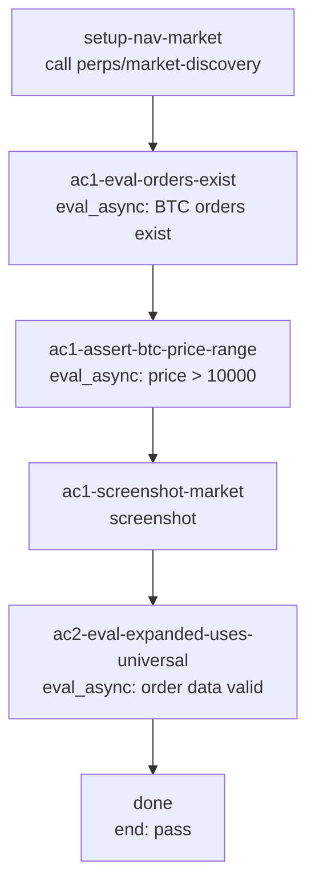

## **Description**

Open orders (limit, TP, SL) on compact order rows displayed trigger/limit prices with fixed 2 decimals. Changed `PRICE_RANGES_MINIMAL_VIEW` to `PRICE_RANGES_UNIVERSAL` in `PerpsCompactOrderRow` so prices use market-appropriate decimals (e.g., 0 for BTC, 2 for mid-range, up to 6 for micro-cap tokens), matching how market prices and expanded order cards already display.

## **Changelog**

CHANGELOG entry: Fixed open order trigger/limit prices showing only 2 decimals instead of market-appropriate precision

## **Related issues**

Fixes: [TAT-3094](https://consensyssoftware.atlassian.net/browse/TAT-3094)

## **Manual testing steps**

```gherkin
Feature: Open order decimal precision

  Scenario: Compact order row shows market-appropriate decimals for BTC
    Given the Trading account has open BTC TP/SL orders with trigger prices > $10,000

    When user navigates to BTC market details and views compact order rows
    Then trigger prices display with 0 decimals (matching market price format)
```

## **Screenshots/Recordings**

<!-- Evidence will be added by the gateway from evidence-manifest.json -->

### **Before**

### **After**

## **Pre-merge author checklist**

- [x] I've followed [MetaMask Contributor Docs](https://github.com/MetaMask/contributor-docs) and [MetaMask Mobile Coding Standards](https://github.com/MetaMask/metamask-mobile/blob/main/.github/guidelines/CODING_GUIDELINES.md).
- [x] I've completed the PR template to the best of my ability
- [x] I've included tests if applicable
- [x] I've documented my code using [JSDoc](https://jsdoc.app/) format if applicable
- [x] I've applied the right labels on the PR (see [labeling guidelines](https://github.com/MetaMask/metamask-mobile/blob/main/.github/guidelines/LABELING_GUIDELINES.md)). Not required for external contributors.

#### Performance checks (if applicable)

- [ ] I've tested on Android
  - Ideally on a mid-range device; emulator is acceptable
- [ ] I've tested with a power user scenario
  - Use these [power-user SRPs](https://consensyssoftware.atlassian.net/wiki/spaces/TL1/pages/edit-v2/401401446401?draftShareId=9d77e1e1-4bdc-4be1-9ebb-ccd916988d93) to import wallets with many accounts and tokens
- [ ] I've instrumented key operations with Sentry traces for production performance metrics
  - See [`trace()`](/app/util/trace.ts) for usage and [`addToken`](/app/components/Views/AddAsset/components/AddCustomToken/AddCustomToken.tsx#L274) for an example

For performance guidelines and tooling, see the [Performance Guide](https://consensyssoftware.atlassian.net/wiki/spaces/TL1/pages/400085549067/Performance+Guide+for+Engineers).

## **Pre-merge reviewer checklist**

- [ ] I've manually tested the PR (e.g. pull and build branch, run the app, test code being changed).
- [ ] I confirm that this PR addresses all acceptance criteria described in the ticket it closes and includes the necessary testing evidence such as recordings and or screenshots.

## **Validation Recipe**

<details>
<summary>recipe.json</summary>

```json
{
  "pr": "29799",
  "title": "Open order prices use market-appropriate decimals",
  "jira": "TAT-3094",
  "acceptance_criteria": [
    "AC1: Compact order rows display trigger/limit price with market-appropriate decimals instead of fixed 2 decimals",
    "AC2: Expanded order card detail view continues to display trigger/limit price correctly (no regression)"
  ],
  "validate": {
    "static": ["yarn lint:tsc"],
    "workflow": {
      "pre_conditions": ["wallet.unlocked", "perps.feature_enabled"],
      "entry": "setup-nav-market",
      "nodes": {
        "setup-nav-market": {
          "action": "call",
          "ref": "perps/market-discovery",
          "params": { "symbol": "BTC" },
          "next": "ac1-eval-orders-exist"
        },
        "ac1-eval-orders-exist": {
          "action": "eval_async",
          "expression": "Engine.context.PerpsController.getOpenOrders().then(function(orders) { var btcOrders = orders.filter(function(o) { return o.symbol === 'BTC' && o.status === 'open'; }); var results = btcOrders.map(function(o) { var tp = parseFloat(o.triggerPrice || o.price || '0'); return { orderId: o.orderId, triggerPrice: tp, type: o.detailedOrderType }; }); return JSON.stringify({ count: btcOrders.length, orders: results }); })",
          "assert": { "operator": "gt", "field": "count", "value": 0 },
          "next": "ac1-assert-btc-price-range"
        },
        "ac1-assert-btc-price-range": {
          "action": "eval_async",
          "expression": "Engine.context.PerpsController.getOpenOrders().then(function(orders) { var btcOrders = orders.filter(function(o) { return o.symbol === 'BTC' && o.status === 'open'; }); var o = btcOrders[0]; var price = parseFloat(o.triggerPrice || o.price || '0'); var isHighPrice = price > 10000; return JSON.stringify({ price: price, isHighPrice: isHighPrice, expectedMaxDecimals: isHighPrice ? 0 : 2, detailedType: o.detailedOrderType }); })",
          "assert": { "operator": "eq", "field": "isHighPrice", "value": true },
          "next": "ac1-screenshot-market"
        },
        "ac1-screenshot-market": {
          "action": "screenshot",
          "filename": "evidence-ac1-market-details.png",
          "note": "AC1: BTC market details screen showing order data available",
          "next": "ac2-eval-expanded-uses-universal"
        },
        "ac2-eval-expanded-uses-universal": {
          "action": "eval_async",
          "expression": "Engine.context.PerpsController.getOpenOrders().then(function(orders) { var btcOrders = orders.filter(function(o) { return o.symbol === 'BTC' && o.status === 'open'; }); var results = btcOrders.map(function(o) { var price = parseFloat(o.triggerPrice || o.price || '0'); return { orderId: o.orderId, price: price, type: o.detailedOrderType, priceShouldHaveZeroDecimals: price > 10000 }; }); return JSON.stringify({ count: results.length, orders: results }); })",
          "assert": { "operator": "gt", "field": "count", "value": 0 },
          "next": "done"
        },
        "done": { "action": "end", "status": "pass" }
      }
    }
  }
}
```

</details>

## **Recipe Workflow**

<details>
<summary>workflow.mmd</summary>



</details>
